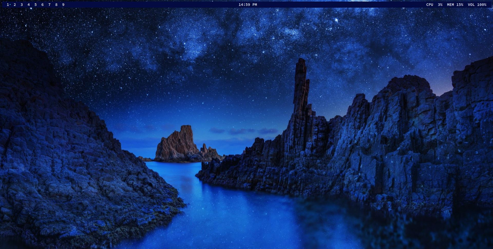
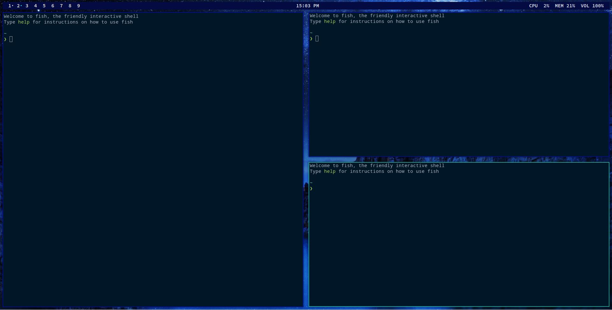

# Ocean-night

## A simple blue-scale theme for LeftWM

Based on the Candy theme from ArcoLinux

Couldn't find the artist of the background but got the image from [here](https://wallpapersafari.com/w/64Ims7)

## Screenshots

## Requirements
- Polybar
- Picom
- Feh
- SauceCodePro Nerd Font

## Installation
1. git clone https://github.com/TheRoniOne/ocean-night.git
2. ln -s ocean-night $HOME/.config/leftwm/themes/current
3. super + shift + r to reload LeftWM

## Common issues
If more than one polybar is stacking, just use killall -q polybar and reload LeftWM using super + shift + r